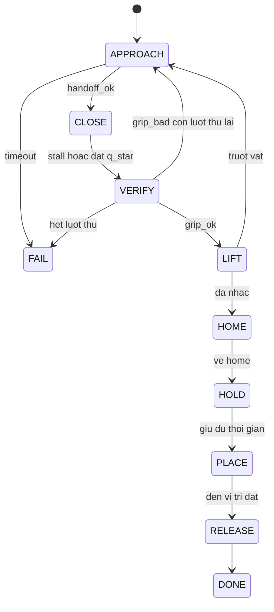

# Đề Xuất RL Lai (Hybrid) Cho Cánh Tay ASSARM: RL Tiếp Cận Và Căn Chỉnh, Script Đóng–Nhấc–Đặt (v5.0)

> **Hệ thống:** cánh tay 4-DOF + gripper song song, 5 servo PWM điều khiển bởi ESP32 qua UART từ Raspberry Pi 4; huấn luyện trong Ignition Gazebo 6.17.1 (Fortress) + ROS 2 Humble, triển khai trên robot thật.
> **Kiến trúc lai:** **RL chỉ điều khiển 4 khớp tay ở giai đoạn tiếp cận và căn chỉnh.** Đóng gripper, kiểm tra kẹp, nhấc lên, về home và đặt xuống do **script (máy trạng thái)** đảm nhiệm. Mục đích: học nhanh hơn (không học tiếp xúc, không học gripper), an toàn hơn trên robot thật, và kết quả cuối cùng đo được bằng chính script sẽ chạy trên robot.
> **Phạm vi v5.0:** đã **loại bỏ toàn bộ nội dung UAV/bay** (hover, nhiễu nền, trạng thái nền, cổng khả thi hover, Phase U, an toàn bay). Mục tiêu hiện tại là cánh tay gá cố định gắp **một khối lập phương treo bằng dây con lắc**.
> **Nguyên tắc:** mọi con số tốc độ và mô hình cảm biến/servo/con lắc là *giả thuyết cho đến khi đo*; chi tiết chưa xác minh được đánh dấu **[CẦN KIỂM CHỨNG]**.

---

## 1. Bối cảnh và mục tiêu

### 1.1. Hệ thống

| Thành phần | Chi tiết |
|:---|:---|
| Cánh tay | ASSARM: J1 base-yaw (trục z), J2 shoulder-pitch (trục x), J3 elbow-pitch (trục x), J4 xoay quanh trục dọc cẳng tay. Giới hạn khớp theo URDF ±π/2 |
| Gripper | 1 khớp chủ động `Revolute_Joint_Active` (trục y) + 5 khớp mimic (`Passive` −1, `Joint_5` +1, `Joint_8` −1, `Pivot_Left` −1, `Pivot_Right` +1). Hai ngón ở x = ±0,054 m trong khung `Plate_1`; **ngón khép theo trục x của `Plate_1`**, trục y là bản lề |
| Servo | J1 TD8120MG (1,81–2,23 N·m); J2 RDS3120 (1,47–2,06 N·m); J3, J4, gripper MG995 (0,92–1,27 N·m) |
| Điều khiển cấp thấp | Pi 4 → UART → ESP32 → PWM 50 Hz → servo. Feedback là góc thật của trục qua biến trở nội servo, lọc EMA ở ESP32 |
| Camera | RPi CSI 5 MP (dự kiến), gắn cố định gần base, lệch trục tay ≤ 5 cm; marker dán trên mặt trên khối |
| Sim | Ignition Gazebo 6.17.1 (`ign gazebo`); ros2_control qua `gz_ros2_control` (đã nạp được trong Fortress, mimic hoạt động, xem 4.8); hai controller manager (`/` cho tay, `/rig` cho bệ); `ros_gz_bridge` bridge được dịch vụ (`ControlWorld`) |
| Máy train | i5-1035G4 (4 nhân / 8 luồng), 12 GB RAM, không GPU; PyTorch 2.11 CPU, SB3 2.8.0, Gymnasium 0.29.1 |

### 1.2. Nhiệm vụ và phân vai RL / script

**Vật:** khối lập phương 5 × 5 × 5 cm, 0,1 kg, treo dưới bệ `pedestal_rig` (6 bậc tự do) bằng dây dài 30 cm qua khớp cầu (con lắc). Không còn bàn.



| Giai đoạn | Bên điều khiển | Nội dung |
|:---|:---|:---|
| **APPROACH** | **RL** (4 khớp tay) | Đưa tâm gắp tới đúng vị trí và căn yaw cho khối đang đung đưa; gripper giữ mở |
| Kích hoạt (`handoff_ok`) | Script | Khi điều kiện bàn giao (3.5) đúng liên tục 3 step thì ngắt RL, chuyển sang script |
| **CLOSE** | Script | Đóng gripper đến `q*`, dừng khi phát hiện bị chặn (`target − q`) |
| **VERIFY** | Script | Kiểm tra góc chặn nằm trong cửa sổ hợp lệ (xem dưới); sai thì mở lại và quay về APPROACH (tối đa N lần) |
| **LIFT / HOME / HOLD** | Script | Nhấc lên, đưa 4 khớp về 0 (home) với gripper giữ nguyên góc kẹp, giữ vài giây |
| **PLACE / RELEASE** | Script | Hạ xuống vị trí đặt và mở gripper **[CẦN XÁC ĐỊNH: vị trí đặt]** |

**Góc đóng `q*` (đã kiểm tra bằng FK trên URDF).** Với ngón di chuyển như hình bình hành: mỗi má tiến vào `4(1 − cos q)` cm và tụt xuống `4 sin q` cm (FK trên URDF cho đúng các giá trị này, ví dụ q = 0,896 rad → 1,50 cm và 3,12 cm). Gripper mở tối đa 8,0 cm tại q = 0. Để ôm khít khối 5 cm: **`q* = 0,896 rad` (51,3°), má kẹp tụt Δz ≈ 3,12 cm.**

| Tình huống | Góc đóng tương ứng |
|:---|:---|
| Khối 4,7 / 5,0 / 5,3 cm (DR ±3 mm), đóng đúng | 0,943 / 0,896 / 0,847 rad |
| Kẹp chéo (đường chéo 7,07 cm) | ≈ 0,487 rad (gripper bị chặn sớm) |
| Khối lệch yaw 20° chưa kịp xoay thẳng | ≈ 0,642 rad |
| Đóng vào không khí | vượt xa 1,0 rad |

**Cửa sổ hợp lệ khi VERIFY (khởi đầu):** góc chặn sau khi ổn định thuộc `[0,82; 0,97] rad`. Ngoài cửa sổ nghĩa là kẹp chéo, lệch, hoặc đóng hụt, nên mở ra và thử lại. Phép kiểm tra chỉ dùng góc feedback, có sẵn trên robot thật.

**Tâm gắp.** `gc_open` là điểm giữa hai má khi mở hoàn toàn. Khi đóng, vật nằm tại **`P_close = gc_open + R_gripper · [0, 0, −0,0312]`**, nên mục tiêu tiếp cận của RL là `P_close` (không phải `gc_open`), loại bỏ sai số độ cao 3,1 cm. Độ lệch giữa điểm giữa hai gốc ngón (từ URDF) và tâm má kẹp (từ CAD) chưa biết; ghi là `d_off` và đo ở Phase 0.

### 1.3. Baseline (bắt buộc, và là cột mốc sớm)

*Perception (marker) → IK tới `P_close` → cùng script đóng–nhấc–đặt.* Baseline khác RL ở **đúng một chỗ: cách tiếp cận**. Nhờ vậy giá trị của RL được đo sạch: RL chỉ được đưa vào sản phẩm nếu tiếp cận tốt hơn IK trên khối đung đưa. Baseline cũng là hệ thống chạy được ngay (Phase S) trước khi có RL.

### 1.4. Dung sai và tiêu chí chấp nhận

**Dung sai đóng ngón phụ thuộc yaw.** Khi khối lệch yaw φ so với trục đóng ngón, bề rộng giữa hai má là `w(φ) = 5(cosφ + sinφ)` cm (φ ≤ 45°); dung sai ngang một phía bằng nửa khoảng hở `(8 − w)/2`:

| Lệch yaw φ | w (cm) | Dung sai ± (cm) |
|:---|:---|:---|
| 0° | 5,00 | 1,50 |
| 5° | 5,42 | 1,29 |
| 10° | 5,79 | 1,10 |
| 15° | 6,12 | 0,94 |
| 20° | 6,41 | 0,80 |
| 30° | 6,83 | 0,58 |
| 45° | 7,07 | 0,46 |

(Cận thận trọng, giả định má phẳng; má khép lại có thể tự xoay khối thẳng hàng nếu ma sát cho phép.) Với yaw dư ≈ 5° dung sai ≈ ±1,3 cm; để bắt ≥ 90% cần σ_tổng ≲ 0,8 cm theo trục đóng. Với perception σ ≈ 0,4 cm và độ rơ servo ≈ 0,35 cm (giả định chưa đo), phần dư cho chuyển động của khối trong lúc đóng cỡ **0,6 cm**.

**Định nghĩa thành công:**
- `handoff_ok` (giai đoạn RL): tại thời điểm bàn giao, độ lệch trong khung gripper nằm trong ngưỡng (3.5).
- **Thành công tổng:** khối còn trong gripper sau LIFT, và tay về home giữ khối ≥ 3 s (rồi đặt xuống nếu có PLACE).

| Cấp | Điều kiện | Tiêu chí |
|:---|:---|:---|
| **C1a — Sim, tiếp cận** | RL, DR + mô hình cảm biến, khối đung đưa đủ biên độ | `handoff_ok` ≥ 90% (100 episode) **và** tốt hơn baseline IK |
| **C1b — Sim, tổng** | RL + script | Thành công tổng ≥ 85% |
| **C2a — Robot thật, khối đứng yên** | Dây cố định hoặc khối giữ yên, ≥ 50 lần | ≥ 47/50 (cận Wilson dưới ≈ 0,84), không thấp hơn baseline |
| **C2b — Robot thật, khối đung đưa (chấp nhận sản phẩm)** | ≥ 100 lần | **≥ 90% với độ tin cậy 95%**: ≥ 96/100 (cận dưới 0,902) |

Để khẳng định ≥ 90% cần 96/100 (0,902) hoặc 50/50 (0,929); 49/50 chỉ cho 0,895.

### 1.5. Các tham số & thông tin đã xác định (Cập nhật v5.0)

| Mục | Nội dung đã xác định & Cập nhật | Tác động / Thiết kế |
|:---|:---|:---|
| **Vùng spawn** | Dời về bán kính ngang **r = 0,08 – 0,19 m** → Cần xác nhận lại bằng IK với `d_off` thật ở Phase 0 | Giới hạn vùng bệ treo khối |
| **Con lắc sim** | `damping = 0,1` (ζ ≈ 0,97) làm khối không đung đưa (sai nghiêm trọng) → **Đổi về `0,003` ngay lập tức**, đo đạc phần cứng sau để hiệu chỉnh chuẩn | Mô hình physics con lắc sim |
| **Dây & Arm sau kẹp** | Sau khi kẹp thành công (`VERIFY` pass), **dây lập tức đứt ra**. Arm **giữ nguyên vị trí tại chỗ** (không quay về home) | Script đơn giản hóa: `CLOSE` → `VERIFY` → `HOLD` |
| **Feedback 50 Hz & Nguồn** | 50 Hz feedback là **tần số ADC của ESP32 ngoài**. Không cần lo lắng về điện áp servo và dòng kẹp | Firmware ESP32 đọc ADC ngoài ở 50 Hz |
| **Vị trí Camera** | Đặt **cố định trên base**, hướng về phía trước arm, **bắt trọn khung hình chứa cube** | Mô hình perception & vị trí camera |

---

## 2. Quyết định thiết kế chính

| Hạng mục | Quyết định | Lý do |
|:---|:---|:---|
| Kiến trúc | **Lai:** RL = APPROACH; script = CLOSE/VERIFY/LIFT/HOME/HOLD/PLACE | RL không phải học tiếp xúc và gripper; an toàn và dễ kiểm tra |
| Action RL | 4D (delta 4 khớp tay), gripper do script | Giảm không gian, không có lệnh gripper bất ngờ |
| Bàn giao | **Script tự kích hoạt** khi điều kiện đúng 3 step liên tiếp, RL không "đề nghị" đóng | Đơn giản và an toàn; thời điểm đóng được bảo vệ bởi ngưỡng |
| Kết thúc episode RL | `terminated` khi bàn giao; `truncated` khi hết giờ; thưởng cuối theo chất lượng bàn giao **thật** | RL có đích rõ ràng; tránh thưởng nhầm khi perception nhiễu |
| Thuật toán | **SAC thuần**, `MlpPolicy`, obs phẳng 28D, không HER, không TQC | Reward dense, đích bàn giao rõ |
| Reward | Dense dùng thông tin đặc quyền của sim; không dùng contact để định hướng RL | Contact không có trên robot thật |
| Quan sát | Chỉ thông tin robot thật có; một `build_obs` dùng chung sim và thật | Tránh rò rỉ thông tin của sim |
| Script | Một cài đặt dùng chung cho sim và thật, chỉ dùng tín hiệu triển khai được (feedback, perception) | Kết quả sim phản ánh đúng thứ chạy trên robot |
| Giao diện lệnh | ESP32 nội suy tuyến tính theo chu kỳ điều khiển; sim mô phỏng bằng 5 lệnh con 20 ms (4.6) | Khớp firmware |
| Chuẩn hóa | Thủ công, range cố định | Nhất quán sim/thật và giữa stage |
| Warm-start | Chuyển actor + critic + `ent_coef` giữa stage; không mang replay buffer | Reward đổi |
| DR | Bắt buộc, kèm curriculum nhiễu | Sim-to-real |

---

## 3. Thiết kế bài toán

### 3.1. Vật, hình học và vùng đặt khối

**Vật.** Khối 5 × 5 × 5 cm theo CAD, collision box 0,05 × 0,05 × 0,05 m. Khối lượng 0,1 kg trong sim (`cube_link`, `μ₁ = μ₂ = 1,0`), DR ±30% (0,07–0,13 kg). Treo bằng `rope_link` dài 30 cm, đường kính 3 mm, gắn dưới bệ `pedestal_rig` qua khớp cầu. Bàn tĩnh đã bỏ.

**Động học thuận (FK từ URDF, kiểm tra độc lập).**
- Cơ cấu kẹp: công thức tiến vào/tụt xuống ở 1.2 khớp với FK của URDF (q = 0,3; 0,6; 0,896; 1,2).
- Tầm với: điểm xa nhất của khung gripper theo phương ngang khoảng **0,40 m** (cánh tay duỗi ngang, ở độ cao ~0,5 m), phù hợp với tầm với tối đa ~0,38 m bạn nêu. Tuy nhiên đó là tầm với *khi tay duỗi ngang*, không phải tầm với *ở độ cao khối* (0,2–0,3 m), như bên dưới.
- Home: 4 khớp = 0, tay thẳng đứng hướng xuống. Điểm giữa hai gốc ngón cao ≈ 0,175 m (tâm kẹp mở ≈ 0,18 m); `P_close` tại home cao ≈ 0,144 m.

**Vùng với tới thật tại độ cao khối (kết quả FK, điểm giữa hai gốc ngón cộng `[0,0,−0,0312]` theo trục gripper; độ nghiêng gripper do vị trí quyết định vì chỉ có J2, J3 gập):**

| Độ cao `P_close` (m) | Bán kính ngang, mọi độ nghiêng | nghiêng < 25° | nghiêng < 15° |
|:---|:---|:---|:---|
| ≈ 0,18 | 0,005 – 0,188 | 0,005 – 0,184 | 0,010 – 0,163 |
| ≈ 0,22 | 0,005 – 0,245 | 0,007 – 0,222 | 0,051 – 0,192 |
| ≈ 0,26 | 0,005 – 0,286 | 0,051 – 0,239 | 0,078 – 0,206 |
| ≈ 0,30 | 0,123 – 0,316 | 0,146 – 0,243 | 0,146 – 0,207 |
| ≈ 0,35 | 0,183 – 0,343 | không có | không có |

**Vùng spawn bạn nêu mâu thuẫn với FK.** Bảng spawn gốc (r = 0,28–0,30 m ở Level 0, độ cao 0,23–0,26 m) và nhận định "nghiêng < 15° với r ∈ [0,12; 0,32] m" không thỏa:
- Với `d_off = 0` (tâm kẹp trùng điểm giữa hai gốc ngón), Level 0 **không có cấu hình nào với tới**; Level 1 cần nghiêng tối thiểu ≈ 41°, Level 2 ≈ 34°, Level 3 ≈ 28°.
- Với `d_off` tới 6 cm (rộng rãi), Level 0–3 vẫn cần nghiêng tối thiểu ≈ 27°, 25°, 23°, 21°: **không bao giờ dưới 15°**.
- Vùng nghiêng < 15° ở độ cao 0,24 m chỉ gồm bán kính ≈ 0,06–0,20 m (`d_off = 0`) tới ≈ 0,14–0,22 m (`d_off = 6 cm`). Tối đa bán kính với nghiêng < 15° ở mọi độ cao chỉ ≈ 0,21 m.

Nghĩa là bệ ở bán kính 0,28–0,30 m (gốc bệ `Y = 0,30 m`) quá xa; gripper sẽ nghiêng 30–40° hoặc không tới. **Có thể do định nghĩa khác (gốc tọa độ, `d_off`, điểm đo bán kính).** Dưới đây là kiểm tra độc lập của tôi từ khung khớp URDF; không có mesh nên chưa chính xác tuyệt đối. Cần kiểm lại bằng IK với `d_off` thật (Phase 0).

**Vùng spawn đề xuất** (đã kiểm tra: ≥ 95% điểm có cấu hình nghiêng < 15° nếu `d_off ≤ 2 cm`; còn 70–86% nếu `d_off = 4 cm`, khi đó giới hạn r ≤ 0,17 m):

| Cấp | Bán kính ngang r (m) | Góc quét J1 θ | Độ cao khối z (m) | Yaw | Biên độ đung đưa |
|:---|:---|:---|:---|:---|:---|
| Level 0 | 0,10 – 0,14 | ±15° | 0,22 – 0,25 | ±15° | 0 (khối đứng yên) |
| Level 1 | 0,09 – 0,16 | ±20° | 0,21 – 0,26 | ±20° | ≤ 0,5 cm |
| Level 2 | 0,08 – 0,18 | ±35° | 0,20 – 0,27 | ±25° | ≤ 1,5 cm |
| Level 3+ | 0,08 – 0,19 | ±60° | 0,20 – 0,27 | ±45° | ≤ 2,5 cm |

Yaw khối quy về `Δψ ∈ [−45°, +45°]` so với trục đóng ngón nhờ đối xứng 90°. Bệ `pedestal_rig` đặt khối theo cấp (bệ treo ở độ cao sao cho khối ở đúng độ cao z và dây thẳng đứng).

### 3.2. Con lắc: tham số sim hiện tại sai lệch rõ

Với khối 0,1 kg, dây 30 cm (xem khối như khối lượng điểm cách khớp 0,30 m):

| Đại lượng | Giá trị |
|:---|:---|
| Tần số riêng | ω₀ = √(g/L) ≈ 5,72 rad/s → **0,91 Hz** (chu kỳ 1,10 s) |
| Giảm chấn khớp cầu 0,1 N·m·s/rad | **ζ ≈ 0,97**: gần tới hạn, **gần như không dao động** |
| Giảm chấn thật điển hình ζ ≈ 0,01–0,05 | b ≈ 0,001–0,005 N·m·s/rad (≈ 30 lần nhỏ hơn 0,1) |
| Ma sát Coulomb khớp cầu 0,02 N·m | khối "kẹt" khi lệch góc < 0,068 rad ≈ 3,9°, tức **lệch ngang tới ±2,0 cm** quanh phương thẳng đứng |
| Ma sát 0,0005 N·m | vùng kẹt ≈ ±0,5 mm |

Hệ quả: với `damping = 0,1` và `friction = 0,02` hiện tại, khối **không đung đưa chân thực** mà đứng yên tại một vị trí ngẫu nhiên lệch tới 2 cm (tức bằng dung sai đóng ngón). Tham số này nên **hiệu chỉnh từ đo thật**: thả khối từ độ lệch ~3 cm, đo chu kỳ (suy ra chiều dài hiệu dụng) và độ suy giảm biên độ (suy ra giảm chấn); khởi đầu thử `damping ≈ 0,003`, `friction ≈ 0,0005`. DR: chiều dài ±10%, giảm chấn lấy theo log-đều quanh số đo, ma sát quanh số đo.

**Khởi tạo đung đưa mỗi episode:** với ζ ≈ 0,03, thời gian suy giảm cỡ 6 giây mô phỏng nên không chờ lắng giữa các episode. Đặt biên độ và pha khởi đầu ngẫu nhiên theo cấp (3.1), bằng cách `set_pose` khối/dây hoặc "kick" ngắn của bệ **[CẦN KIỂM CHỨNG cách nào ổn định trong Fortress]**. Biên độ đung đưa 1 cm tương ứng vận tốc đỉnh ≈ 5,7 cm/s; điều kiện bàn giao đòi vận tốc tương đối thấp (3.5), nên RL phải học căn thời điểm.

### 3.3. Observation (28D, phẳng, triển khai được, chuẩn hóa thủ công)

| # | Thành phần | Dim | Nguồn trên robot thật | Chuẩn hóa |
|:---|:---|:---|:---|:---|
| 1–4 | Góc 4 khớp tay | 4 | Feedback biến trở (đã lọc, hiệu chuẩn) | `/ giới hạn khớp` |
| 5–8 | Vận tốc 4 khớp tay | 4 | Sai phân `(q_t − q_{t−1}) / dt_ctrl` | `/ 2 rad/s`, clip ±1 |
| 9–12 | `target − q` (4 khớp) | 4 | env tự giữ | `/ ε`, clip ±1 |
| 13–15 | Vị trí `P_close` | 3 | FK từ `q` + offset `[0,0,−0,0312]` | `/ 0.3 m` |
| 16–18 | Vị trí khối trong hệ base | 3 | Camera + marker | `/ 0.3 m` |
| 19–21 | **Vận tốc khối (đã lọc)** | 3 | Bộ lọc trên chuỗi perception (alpha-beta hoặc Kalman với mô hình con lắc), dùng chung sim/thật | `/ 0.1 m/s`, clip ±1 |
| 22–24 | `e = R_gripperᵀ (khối − P_close)` (x: trục đóng, y: dọc ngón, z: trục gripper) | 3 | tính toán | `/ 0.1 m` |
| 25–26 | `sin(4Δψ)`, `cos(4Δψ)` | 2 | Yaw khối (marker) trừ yaw trục đóng ngón (FK đầy đủ) | không cần |
| 27 | Độ nghiêng gripper so với phương thẳng đứng | 1 | FK | `/ 0.5 rad` |
| 28 | `pose_valid` | 1 | Cờ perception | nhị phân |

- Gripper không có trong obs vì RL không điều khiển và gripper luôn mở trong APPROACH.
- **Vận tốc khối lọc** quay lại obs vì con lắc là khó khăn chính; vận tốc sai phân thô quá nhiễu (σ vị trí 4 mm ở 10 Hz cho nhiễu vận tốc cỡ 5,7 cm/s, bằng chính vận tốc con lắc), nên phải lọc.
- **Yaw tương đối:** `Δψ = wrap_to_±45°(yaw_khối − yaw_hàm_kẹp)`, `yaw_hàm_kẹp` là hướng ngang của trục x của `Plate_1`, tính bằng **FK đầy đủ** (không dùng `FK(q[0], q[3])`: công thức xấp xỉ `ψ₀ − q₁ − q₄` đúng khi nghiêng < 20° nhưng có đuôi sai lớn khi nghiêng 20–25° và ở một số tư thế gập). Do khối đối xứng 90°, chọn nhầm trục x/y chỉ lệch hằng số 90°, nhưng sai số lệch ngang phải đo theo x.
- **Hàm dựng obs dùng chung:** `build_obs(...) → np.ndarray(28)` đặt trong `assarm_common`, nhập bởi env và triển khai.

### 3.4. Action (4D)

```python
action_space = spaces.Box(-1.0, 1.0, shape=(4,), dtype=np.float32)   # delta J1..J4
target = clip(target + a * max_delta, q_lo, q_hi)                    # max_delta ~0.08 rad/step (khởi đầu)
target = clip(target, q_meas - EPS_ARM, q_meas + EPS_ARM)            # EPS_ARM ~0.25 rad
```

- `max_delta`, `q_lo/q_hi` lấy từ giới hạn servo thật và cơ khí (hẹp hơn URDF); `max_delta` 0,08 rad/step ở 10 Hz = 0,8 rad/s là điểm khởi đầu.
- Gripper bị khóa ở trạng thái mở trong APPROACH.

### 3.5. Bàn giao, reward, kết thúc

**Điều kiện bàn giao `handoff_ok`** (đúng liên tiếp 3 step, khởi đầu; tính từ đại lượng perception đã lọc trong triển khai):

| Đại lượng | Ngưỡng khởi đầu |
|:---|:---|
| `|e_x|` (trục đóng) | ≤ 0,6 cm |
| `|e_y|` (dọc ngón) | ≤ 1,0 cm |
| `|e_z|` (trục gripper) | ≤ 0,6 cm |
| `|Δψ|` | ≤ 10° |
| Độ nghiêng gripper | ≤ 15° |
| Tốc độ tương đối khối–gripper | ≤ 2 cm/s |

**Reward (dense, tính trong `step()` bằng pose thật của khối trong sim):**

```python
def reward(self):
    d = norm(self.obj_true - self.P_close)
    dpsi = wrap_to_pm45(self.yaw_obj_true - self.yaw_jaw)
    w_near = clip(1.0 - d / 0.08, 0.0, 1.0)
    r = -d + W_NEAR * (1.0 - tanh(d / 0.03)) \
        - 0.3 * w_near * abs(dpsi) / (pi / 4) \
        - 0.2 * max(0.0, self.tilt_deg - 15.0) / 15.0 \
        - 0.1 * w_near * min(self.rel_speed / 0.05, 1.0) \
        - 0.5 * float(self.jaw_cube_contact) \
        - 0.01 * sum(self.last_action**2) \
        - self.w_rate * sum((self.last_action - self.prev_action)**2)
    return r
```

- `W_NEAR` khởi đầu 0,3 (A/B ở Phase 1: chỉ `−d` so với `−d` + số hạng gần). Giữ `−d` vì hàm có chặn phẳng dần ở xa nên gradient dẫn hướng biến mất.
- Phạt `jaw_cube_contact` (contact thật trong sim, chỉ dùng cho reward): ngón mở chạm khối trước khi bàn giao là xấu (đẩy khối đi).
- `w_rate` khởi đầu 0,01, tăng dần (tới 0,03–0,05) khi policy ổn định, để hạn chế lắc giật; phạt quá mạnh làm tay chậm bám khối đung đưa.
- **Kết thúc:** khi script kích hoạt bàn giao (từ đại lượng đã lọc, như trên robot thật) thì `terminated = True` và thưởng cuối **dựa trên chất lượng bàn giao thật** (pose thật): `+10` nếu mọi ngưỡng thật đều thỏa, `−2` nếu không (nhận biết bàn giao nhầm do nhiễu). `truncated = True` khi hết giờ (60 step ở Stage A, 80 step ở Stage B) hoặc khi khối bị đẩy ra xa vùng hợp lệ (`info["cube_lost"]=True`).
- Vì có kết thúc khi thành công và thưởng cuối dương lớn hơn tổng phạt còn lại, agent không có động cơ né bàn giao.

**Chỉ số đánh giá (sim, pose thật):** `handoff_rate`; `time_to_handoff`; `handoff_error` (e_x, e_y, e_z, Δψ lúc bàn giao); `false_handoff_rate` (script kích hoạt nhưng pose thật không thỏa); **`overall_success`** (chạy script đầy đủ sau bàn giao); `mean_abs_action`; `jaw_cube_contact_rate`. Báo cáo theo cấp spawn và theo biên độ đung đưa, kèm Wilson 95%.

### 3.6. Script: chi tiết điều khiển (dùng chung sim/thật)

- **Môi trường chạy:** thư viện thuần Python/NumPy trong `assarm_common`; trên Pi 4 là máy trạng thái ở nhịp 10 Hz (hoặc 50 Hz cho đoạn đóng), trong sim được gọi từ env. Chỉ dùng feedback góc và perception, không dùng contact/pose thật.
- **CLOSE:** nội suy tuyến tính `q_target` từ 0 đến `q* + EPS_GRIP` (EPS_GRIP ≈ 0,1 rad để có lực kẹp) với tốc độ ≈ 0,8 rad/s. Phát hiện bị chặn khi `|target − q| > 0,05 rad` ít nhất 3 mẫu liên tiếp. Giữ đủ lâu để lực ổn định.
- **VERIFY:** góc chặn thuộc `[0,82; 0,97] rad` thì `grip_ok`; ngoài cửa sổ thì mở và quay lại APPROACH (tối đa 2 lần).
- **LIFT:** dịch tâm kẹp lên Δh ≈ 4 cm bằng IK số (Jacobian) từ `assarm_common`, giữ độ nghiêng; kiểm góc gripper không tăng (khối trượt thì lùi về APPROACH).
- **HOME:** nội suy khớp từ cấu hình hiện tại về `[0,0,0,0]` với tốc độ giới hạn, gripper giữ nguyên góc kẹp. Kiểm tra góc gripper ổn định suốt đường đi.
- **HOLD → PLACE → RELEASE:** giữ ≥ 3 s ở home; PLACE hạ xuống vị trí đặt **[CẦN XÁC ĐỊNH]** và mở gripper.
- **Dây (sim):** tách dây sau `grip_ok` (xóa khớp/`DetachableJoint`), nếu không khối sẽ bị dây căng kéo lại khi về home **[CẦN KIỂM CHỨNG và xác định cơ chế trên robot thật, 1.5]**.
- **Hủy bỏ (abort):** quá thời gian từng trạng thái, dòng/độ lệch gripper vượt ngưỡng, mất perception quá lâu → dừng, giữ vị trí, mở gripper chỉ khi chưa kẹp được vật.

### 3.7. Mô hình servo, cảm biến và domain randomization

**`ServoModel`** (giữa target và lệnh vào Gazebo; chỉ giữ phi tuyến, độ trễ do `position_proportional_gain` của plugin, 4.6): vùng chết 0,5–1°; độ rơ 1–2° (J4 ảnh hưởng trực tiếp độ chính xác yaw); giới hạn tốc độ theo tải; võng do trọng lực theo tư thế. Hiệu chỉnh bằng đáp ứng bước (Phase R).

**Giới hạn mô-men (sửa URDF; hiện 5,0 / 2,0 N·m vượt xa servo thật):**

| Khớp | Servo | `effort` (N·m) |
|:---|:---|:---|
| Revolute_Joint_1 | TD8120MG | 1,8 |
| Revolute_Joint_2 | RDS3120 | 1,45 |
| Revolute_Joint_3 | MG995 | 0,9 |
| Revolute_Joint_4 | MG995 | 0,9 |
| Revolute_Joint_Active (gripper) | MG995 | 0,9 (lực kẹp thật tại ngón đo bằng cân và hiệu chỉnh) |

**Cảm biến:** nhiễu vị trí khối σ ≈ 3–5 mm; nhiễu yaw σ ≈ 5°; **trễ perception 100–200 ms với jitter** (mô hình AR(1) theo step, nội suy từ bộ đệm lịch sử, phân phối đo thật); mất dữ liệu/che khuất giữ giá trị cuối và `pose_valid = 0`; nhiễu feedback khớp σ ≈ 0,5–1° cộng trễ do EMA và lượng tử hóa ADC. Giá trị khởi đầu, hiệu chỉnh bằng số đo Phase R.

**Domain randomization (bắt buộc, kèm curriculum nhiễu):**

| Tham số | Khoảng ban đầu |
|:---|:---|
| Ma sát má kẹp–khối | 0,5 – 2,0 (đo bằng thử kéo trượt) |
| Khối lượng khối | ±30% (0,07 – 0,13 kg) |
| Kích thước khối | ±3 mm mỗi cạnh |
| `effort` từng khớp | ±20% |
| Tham số `ServoModel`, `position_proportional_gain` | ±30% quanh số đo |
| Trễ lệnh và trễ perception (có jitter) | theo phân phối đo thật |
| Con lắc: chiều dài / giảm chấn / ma sát | ±10% / log-đều quanh số đo / quanh số đo |
| Biên độ và pha đung đưa ban đầu | theo cấp 3.1 |
| Vị trí/yaw/độ cao khối | spawn curriculum 3.1 |

---

## 4. Kiến trúc hệ thống và xử lý kỹ thuật (sim)

### 4.1. Cấu hình thời gian

| Tham số | Giá trị khởi đầu | Ghi chú |
|:---|:---|:---|
| `max_step_size` (`dt_phys`) | 0,002 s | Log hiện tại đang ở 0,001 s; giữ 0,001 thì `sim_substeps` gấp đôi |
| `update_rate` ros2_control và broadcaster | 100 Hz | Cảnh báo "update period slower than simulation period" là thông tin, vô hại |
| Tần số điều khiển env | 10 Hz → `dt_ctrl = 0,1 s` | Phải khớp tần số policy trên Pi 4 |
| `sim_substeps` | `dt_ctrl / dt_phys = 50` | |
| Tần số publish pose khối, contact | 100 Hz | **[CẦN KIỂM CHỨNG]** |

**Điều kiện thẳng hàng tick** (mọi nguồn tần số `f`): `1/f` là bội của `dt_phys` và `dt_ctrl` là bội của `1/f`. Kiểm tra bằng stamp giờ mô phỏng (không phải `ros2 topic hz`, đo giờ thật).

### 4.2. Vòng lặp một step (sim luôn pause, cấu hình JGPC + 5 lệnh con)

```python
def step(self, action):
    self._update_target(action)                          # 3.4
    cmd = self.servo_model(self.target)                  # 3.7
    for k in range(1, 6):                                # 5 khung 20 ms, khớp firmware ESP32
        self._publish(cmd_prev + (cmd - cmd_prev) * k / 5)
        self._world_control(multi_step=self.sim_substeps // 5)
    cmd_prev = cmd
    self._wait_fresh(self.t_nominal, timeout=2.0, required={
        "joint_states": 1.0 / self.rate_js, "object_pose": 1.0 / self.rate_pose})
    obs = self.build_obs(*self._sensor_model())          # lọc vận tốc khối, yaw tương đối, v.v.
    self._script_trigger_check()                         # bàn giao nếu điều kiện đúng 3 step
    ...
```

- `t_nominal` tăng đúng số substep đã yêu cầu; stamp đo chỉ để kiểm tra lệch; đặt lại khi khởi động lại Gazebo.
- Dung sai chờ `1/rate` mặc định; chỉ siết xuống `0,5/rate` sau khi xác nhận thẳng hàng.
- Không dùng "đợi ack controller": khi sim pause controller không chạy `update()`.
- Bệ `pedestal_rig` chỉ chuyển động ở **reset** (đặt khối theo cấp, tạo đung đưa ban đầu), không chuyển động mỗi step.
- Sau khi script nhận bàn giao, env chạy đoạn script (CLOSE→HOME…) với cùng cơ chế lệnh con để đo `overall_success`.

### 4.3. Reset

1. Áp DR và chọn cấp spawn; đặt bệ theo cấp.
2. Về home (4 khớp = 0, gripper **mở**), `multi_step` tới khi `|qdot| < 0,01` (tối đa 20 vòng; vượt thì log và khởi động lại Gazebo).
3. `target = q_đo`, `cmd_prev = target`.
4. Tạo đung đưa ban đầu (3.2); khởi tạo bộ lọc và mô hình cảm biến.
5. Đọc obs đầu.

### 4.4. Pose khối và contact (sim)

- **Pose ground truth:** bridge `/world/<w>/dynamic_pose/info` (`Pose_V`) sang `tf2_msgs/msg/TFMessage` rồi lọc theo tên frame; hoặc plugin `PosePublisher` trên khối (100 Hz). Log của bạn cho thấy bridge in tên kiểu dạng `gz.msgs.*` (còn `--help` ghi `ignition.msgs.*`); nếu một tiền tố không nhận thì thử tiền tố kia. **[CẦN KIỂM CHỨNG]** bằng `ign topic -i`.
- **Contact (chỉ cho phạt `jaw_cube_contact` và chỉ số):** `ignition-gazebo-contact-system`, `<sensor type="contact">` trên hai má kẹp, 100 Hz, `<topic>` tường minh, lọc theo collision của khối; kiểm `ros2 interface show ros_gz_interfaces/msg/Contacts`. Nếu không bridge được, dùng khoảng cách má–khối theo FK làm ước lượng.

### 4.5. Dịch vụ Gazebo

`ros_gz_bridge` bridge được dịch vụ: `ros2 run ros_gz_bridge parameter_bridge /world/<tên_world>/control@ros_gz_interfaces/srv/ControlWorld` cho `pause` và `multi_step`. **[CẦN KIỂM CHỨNG]** `ros2 interface list | grep ros_gz_interfaces` có `SetEntityPose` không; nếu không, bridge `/world/<w>/set_pose` bằng cú pháp ba tham số hoặc dùng node C++ nhỏ.

### 4.6. Giao diện lệnh

Workspace hiện chạy `position_controllers/JointGroupPositionController` (JGPC) cho tay, gripper và bệ. Firmware ESP32 nhận target 10 Hz và nội suy tuyến tính trong 100 ms (PWM cập nhật 50 Hz, 5 khung 20 ms), nên **JGPC + 5 lệnh con 20 ms (4.2) khớp trực tiếp firmware**.

**Cấu hình thử ở Phase 0:** (1) JTC `time_from_start = dt_ctrl`, một lần publish; (2) JTC `2 × dt_ctrl`; (3) JGPC, một lệnh bậc thang mỗi chu kỳ; (4) **JGPC + 5 lệnh con (mặc định)**. Tiêu chí: khớp đáp ứng bước servo thật; liên tục vận tốc ở ranh giới 10 Hz; chi phí thời gian mỗi step. (JTC hiện có `allow_nonzero_velocity_at_trajectory_end = true`, `splines`.)

**Từ log:** plugin có `position_proportional_gain = 0.1`, tức lệnh vị trí là luật tỉ lệ (không đặt thẳng vị trí khớp). Theo trí nhớ của tôi (chưa kiểm chứng) vận tốc đích tỉ lệ `gain × sai số × update_rate`, cho đáp ứng bậc nhất với hằng số thời gian cỡ `1/(gain × update_rate)` ≈ 0,1 s ở 100 Hz. **Đây là núm hiệu chỉnh độ trễ servo của sim**: chỉnh cho khớp đáp ứng bước thật; `ServoModel` không cộng thêm độ trễ lần nữa.

### 4.7. Đòn bẩy tốc độ

| Đòn bẩy | Ghi chú |
|:---|:---|
| Collision đơn giản (box/cylinder thay mesh CAD) | Lớn nhất; giữ hình học má kẹp đủ giống thật |
| Headless: `ign gazebo -s` | Bỏ GUI |
| Tắt self-collision link kề | |
| `max_step_size` lớn hơn (2–4 ms) | Kiểm lại thẳng hàng 4.1 |
| 2 instance song song | Chưa rõ; đo tổng step/s với 1 và 2 instance |
| gz-transport trực tiếp thay ROS bridge | Chỉ khi benchmark chỉ ra nút thắt |

Thứ tự khởi động: chạy sim (`-r`) → spawn và activate controllers → rồi mới pause.

### 4.8. Bước 0 của Phase 0: những điều đã xác nhận bằng log và lệnh

| Điều đã xác nhận | Bằng chứng |
|:---|:---|
| Gazebo là Fortress; plugin `gz_ros2_control` nạp được và hardware activate thành công | `[ign gazebo-1]`, `[gz_ros2_control]`, `Successful 'activate' of hardware 'GazeboSimSystem'`; node `/gz_ros2_control`, `/rig/gz_ros2_control` |
| **Không đổi sang `ign_ros2_control`** (cả hai gói đều có nhưng node chạy là `gz_ros2_control`) | `ros2 pkg list`, `ros2 node list` |
| Mimic hoạt động, 5 khớp đúng hệ số URDF | log `... is mimicking joint 'Revolute_Joint_Active' with multiplier ...` |
| Hai controller manager (`/` và `/rig`) chạy, không node trùng; `/joint_states` có đúng 1 publisher | `ros2 node list \| sort \| uniq -d` rỗng; `ros2 topic info -v` |
| Controller hiện tại: `arm_position_controller`, `gripper_position_controller`, `rig_controller`, cùng `JointGroupPositionController` | `ros2 control list_controllers` |
| `/joint_states` ≈ 80 Hz theo giờ thật (62–89 Hz) | `ros2 topic hz`: nếu `update_rate` thật là 100 Hz thì sim ≈ 0,8× thời gian thực lúc đo (GUI + mesh + hai plugin); đo lại headless |

**Chưa xác nhận (làm ở Phase 0/S):** mimic dưới tải (kẹp khối thật trong sim; thực chất là test CLOSE→LIFT của script, 3.6); `effort` có được áp dụng khi khớp bị chặn; `update_rate` 100 trong yaml; thẳng hàng tick theo giờ mô phỏng và `real_time_factor` (`ign topic -e -t /world/<tên_world>/stats`).

---

## 5. Phần cứng thật

### 5.1. Chuỗi Pi 4 → ESP32 → servo

**Firmware ESP32 (độc lập với policy và script):** gói lệnh UART có đầu, độ dài, số thứ tự, CRC (10 Hz từ Pi); nội suy target trong chu kỳ 100 ms, PWM 50 Hz; lọc feedback (oversample, trung vị/EMA, gửi 50 Hz, trễ EMA phải đo); hiệu chuẩn biến trở → góc (sai số < 1°, J4 đặc biệt quan trọng cho yaw); **bảo vệ ở firmware**: kẹp giới hạn khớp, giới hạn tốc độ, watchdog (mất lệnh > 300 ms → giữ vị trí), phát hiện kẹt, giới hạn `|target − q|` của gripper; nguồn servo riêng đủ dòng kẹt, chung mass với ESP32, tụ lớn gần servo, đo điện áp/dòng khi kẹp.

**Pi 4 (kiến trúc triển khai, tách khỏi framework huấn luyện):** actor xuất sang NumPy/ONNX Runtime (không cài PyTorch). Ba luồng/tiến trình độc lập, trao đổi bằng bộ đệm có timestamp: (1) perception (ảnh → marker → pose → lọc vận tốc); (2) vòng điều khiển đúng nhịp 10 Hz bằng đồng hồ đơn điệu: đọc mẫu mới nhất → `build_obs` → suy luận RL (APPROACH) hoặc bước script → gửi lệnh; (3) giao tiếp UART. Nếu đo thấy jitter vòng điều khiển lớn khi camera chạy, tách thành tiến trình riêng hoặc viết luồng UART/perception bằng C++ (GIL). Ghi jitter từng tick; chính đó là phân phối trễ cho 3.7. **[CẦN KIỂM CHỨNG thời gian suy luận và jitter trên Pi 4 khi chạy đồng thời camera + UART]**

### 5.2. Camera và perception

- **Marker:** AprilTag (36h11), cạnh **3,5 cm** dán ở **mặt trên** khối (còn viền trắng 0,75 cm mỗi phía); cho vị trí lẫn yaw. Cân nhắc marker thứ hai ở mặt bên để giảm mất dấu.
- **Vị trí camera (lệch trục tay ≤ 5 cm, độ cao và nghiêng tự do):** đặt cao nhất có thể, nghiêng xuống về phía tâm vùng đặt khối. Ở 0,4 m một camera với FOV ~54° × 41° phủ khoảng 0,41 × 0,30 m; marker 3,5 cm khoảng 55 px ở 640 px. Module 5 MP cổ điển thường chỉnh tay tiêu cự: lấy nét ở 0,3–0,5 m.
- **Che khuất là rủi ro chính:** gripper hạ xuống ngay trên khối nên che mặt trên ở đoạn cuối. Khi mất dấu giữ ước lượng cuối kèm bộ lọc dự đoán theo mô hình con lắc, và `pose_valid = 0` để policy biết. Chọn vị trí camera bằng phân tích hình học (FK + capsule, ray-cast tới marker qua các tư thế tiếp cận), chạy trên CPU.
- **Hiệu chuẩn:** nội tại (bàn cờ) và ngoại tại camera → base (có thể dùng chính cánh tay với marker gắn gripper). Timestamp lúc chụp.
- Dán marker được nên đủ cho v5.0; khối không marker cần pipeline ước lượng pose riêng (ngoài phạm vi).

---

## 6. Thuật toán SAC

`MlpPolicy`, obs 28D, action 4D, cùng kiến trúc mọi stage.

| | Giá trị khởi đầu |
|:---|:---|
| `net_arch` | `[256, 256, 256]` |
| `gamma` | 0,98 |
| `learning_rate` | 3e-4 |
| `batch_size` | 256 |
| `buffer_size` | 3e5 |
| `learning_starts` | 2000 |
| `train_freq` / `gradient_steps` | 1 / 4 |
| `ent_coef` | `"auto"` |

Chưa tune. `torch.set_num_threads(2)`; đo thời gian gradient step ở Phase 0 (mục tiêu < 20% thời gian env step). Không pin cứng `torch`, ghi bằng `pip freeze`.

**Warm-start giữa stage:** cùng obs/action, reward cùng họ dense; chuyển actor + critic + critic_target + `log_ent_coef`, không mang replay buffer. Đầu stage mới so sánh nhanh ~20k step: (a) copy tất cả, (b) chỉ copy actor; giảm learning rate xuống 1×10⁻⁴ trong ~20k step đầu; thu 3–5k transition bằng actor đã chép với `learning_starts=0`, `gradient_steps=0` rồi mới đặt `gradient_steps=4` **[CẦN KIỂM CHỨNG trong SB3 2.8.0]** (không tăng `learning_starts` để làm ấm vì SB3 dùng hành động ngẫu nhiên trước ngưỡng đó). Ghi Q-value trung bình vào TensorBoard (thêm callback) để phát hiện overestimation.

---

## 7. Lộ trình, ngân sách, phase

### 7.1. Ngân sách tính toán (giả thuyết; ít hơn nhiều so với v4 vì episode ngắn, action 4D, không học tiếp xúc)

Ước tính step: Stage A ≈ 1×10⁵; Stage B ≈ 3×10⁵; Stage C (tùy chọn, thưởng theo kết quả script) ≈ 1×10⁵. Ngân sách tối đa 1,2×: 1,2×10⁵ / 3,6×10⁵ / 1,2×10⁵.

| Env step/s | Stage A | Stage B | Stage C | Tổng |
|:---|:---|:---|:---|:---|
| 5 | ~6,7 giờ | ~20 giờ | ~6,7 giờ | ~33 giờ |
| 10 | ~3,3 giờ | ~10 giờ | ~3,3 giờ | ~17 giờ |
| 20 | ~1,7 giờ | ~5 giờ | ~1,7 giờ | ~8 giờ |

Con số step/s sớm nhất: ≈ 80 Hz joint states giờ thật cho ≈ 8 env step/s từ vật lý riêng trong điều kiện hiện tại (GUI, mesh), cần đo lại headless.

**Chỉ báo dừng sớm:**

| Mốc | Điều kiện | Hành động |
|:---|:---|:---|
| Stage A, 5×10⁴ step | `handoff_rate` < 30% | Rà reward, ngưỡng bàn giao, vùng spawn khả thi (3.1) |
| Stage B, nhiễu + đung đưa ≈ 50% mục tiêu, sau 1,5×10⁵ step | `handoff_rate` < 30% | Giảm nhiễu tạm; rà bộ lọc vận tốc, ngưỡng tốc độ tương đối |
| Mọi stage | `false_handoff_rate` > 10% | Siết ngưỡng hoặc cải thiện bộ lọc perception |
| 10k step đầu | `mean_abs_action` ≈ 0 | "Đứng hình": rà phạt action |

### 7.2. Quy tắc quyết định ở Phase 0

| Env step/s | Hành động |
|:---|:---|
| < 3 | Dừng; đòn bẩy 4.7, đo lại |
| ≥ 3 | Làm đủ ba stage; 1 seed trước, thêm seed nếu thời gian cho phép |

### 7.3. Các phase

**Phase 0 — Hạ tầng sim (tuần 1–3)**
- [ ] venv, pin `gymnasium==0.29.1 stable-baselines3==2.8.0 tensorboard` (không cần `sb3-contrib`), `pip check`
- [ ] Cấu hình ros2_control (4.8): yaml 100 Hz; một `rig_controller` cho bệ; giữ hai manager với namespace; sửa `effort` (3.7); collision primitive; kiểm `ros2 topic info /joint_states -v` một publisher
- [ ] World: bệ + dây + khối (`damping`, `friction` theo 3.2), contact system, nguồn pose
- [ ] Đo chiều dài ngón, `d_off`, `q_open`, `q_closed`; tính lại vùng spawn bằng **IK với `d_off` thật** (3.1); unit test: với mỗi cấp, lấy 1000 điểm, giải IK, kiểm tỉ lệ nghiêng < 15°
- [ ] Test FK so với Gazebo (< 2 mm); yaw gripper bằng FK đầy đủ
- [ ] Bridge `ControlWorld`; kiểm `SetEntityPose`/`Contacts`
- [ ] Đo tần số/stamp theo giờ mô phỏng; `real_time_factor`; thẳng hàng tick
- [ ] Lag test lệnh → hiệu lực; **A/B giao diện lệnh** (4.6); hiệu chỉnh `position_proportional_gain`
- [ ] Cách tạo đung đưa ban đầu ổn định (`set_pose` hoặc kick bệ) và cơ chế tách dây (3.6)
- [ ] Benchmark tách thành phần; đo reset; step/s tổng ở GUI+mesh, headless+mesh, headless+primitive; đo 1 và 2 instance
- [ ] `check_env`; kiểm `ServoModel`/DR/bộ lọc không làm vỡ `build_obs`
- **Cổng:** quy tắc 7.2; sim ổn định, hai manager, mọi controller activate

**Phase R — Kiểm kê robot thật (song song, tuần 1–5)**
- [ ] Đáp ứng bước từng khớp (nhảy 0,2 rad, ≥ 100 Hz trong 2 s, ×10, có/không tải); vùng chết, độ rơ (đặc biệt J4)
- [ ] Độ trễ đầu-cuối Pi → ESP32 → servo → feedback, ghi phân phối (trung bình, p95, p99, jitter); tần số lệnh tối đa
- [ ] Hiệu chuẩn feedback, chọn EMA; làm rõ "50 Hz", loại ADC; nguồn và dòng khi kẹp
- [ ] Firmware ESP32: nội suy, giới hạn, watchdog, phát hiện kẹt
- [ ] **Gripper thật:** góc ôm khít khối 5 cm (so với `q* = 0,896`), hành vi bị chặn (`target − q`), lực kẹp (cân), ma sát (kéo trượt); thử má kẹp vát/đệm mềm
- [ ] **Con lắc thật:** thả khối từ độ lệch ~3 cm; đo chu kỳ và suy giảm biên độ → `damping`, `friction`, chiều dài hiệu dụng (3.2)
- [ ] Camera: chọn vị trí (phân tích che khuất), hiệu chuẩn, đo nhiễu vị trí/yaw, độ trễ, mất dấu
- [ ] Lớp an toàn (mục 8), kiểm thử khô
- **Cổng:** có số đo cho 3.2, 3.7, `max_delta`, `EPS_GRIP`, `q*`

**Phase S — Script gắp và baseline (tuần 3–6)**
- [ ] Máy trạng thái trong `assarm_common` (3.6); chạy trong sim: CLOSE → VERIFY → LIFT → HOME → HOLD với khối **đứng yên** đặt đúng `P_close` (không RL, không IK)
- [ ] **Đây là test mimic dưới tải**: hai má giữ khối, các khớp theo sau giữ hệ số ±1, khối không tuột; kiểm `effort`
- [ ] Baseline *IK tiếp cận + script* trong sim với khối đứng yên rồi đung đưa; đo tỉ lệ
- [ ] Chạy script trên robot thật với khối đứng yên đặt tay; tinh chỉnh `q*`, cửa sổ VERIFY, tốc độ, `EPS_GRIP`
- **Cổng:** script-only ≥ 90% với khối đứng yên đặt đúng vị trí (sim) và ≥ 8/10 trên robot thật. Nếu không, **không bắt đầu RL**: lỗi nằm ở gripper/script chứ không phải ở tiếp cận

**Phase 1 — RL Stage A: tiếp cận và căn yaw, khối đứng yên (tuần 5–6)**
- [ ] Hoàn thiện env (obs 28D, action 4D, bộ lọc vận tốc, bàn giao, thưởng cuối); Level 0–1; **khối spawn đứng yên (biên độ đung đưa = 0)**; A/B `W_NEAR`
- **Cổng:** `handoff_rate` ≥ 90%, `false_handoff_rate` < 5% (100 episode, deterministic, DR bật, Level 0–1)

**Phase 2 — RL Stage B: toàn vùng spawn, khối đung đưa nhẹ, DR và nhiễu (tuần 7–9)**
- [ ] Warm-start từ Stage A; mở dần Level 2–3; **khối đung đưa nhẹ (biên độ < 1 cm)**; curriculum nhiễu
- **Cổng C1a:** `handoff_rate` ≥ 90% ở Level 3 **và tốt hơn baseline IK**; báo cáo `overall_success` (C1b ≥ 85%)

**Phase 3 — (tùy chọn) Stage C: thưởng theo kết quả script (tuần 9–10)**
- [ ] Sau bàn giao, chạy script đầy đủ; thưởng cuối dựa trên khối còn trong gripper sau LIFT/HOME; có thể chạy trên một phần episode để tiết kiệm thời gian
- **Cổng:** `overall_success` tăng so với Stage B mà không giảm `handoff_rate`

**Phase 4 — Đánh giá sim (tuần 10–11):** 200 episode × số seed, cùng bộ seed, deterministic; mean ± std + Wilson; so với baseline IK trên cùng khối đung đưa; kiểm tra độ bền DR (tham số ngoài khoảng huấn luyện) và độ nhạy với biên độ đung đưa.

**Phase 5 — Chuyển sang robot thật (tuần 11–14)**
- [ ] **5a — Khối đứng yên:** node 10 Hz trên Pi 4 dùng đúng `build_obs` và script; actor xuất NumPy/ONNX; khô (không khối, tốc độ giảm, nút dừng khẩn); so quỹ đạo thật/sim; **C2a:** 50 lần
- [ ] **5b — Khối đung đưa:** vòng hiệu chỉnh 3.2/3.7 từ chênh lệch sim–thật; **C2b:** ≥ 100 lần, ≥ 96 thành công, so với baseline cùng điều kiện
- **Cổng sản phẩm:** đạt C2b; nếu RL không vượt baseline thì giữ baseline (hoặc hybrid IK + RL tinh chỉnh)

> **Lịch:** khoảng 14 tuần đến C2b. Deadline và nhân lực chưa biết nên chưa kiểm được tính khả thi.

### 7.4. Vận hành chạy dài

Checkpoint model **và replay buffer** mỗi 10k step; watchdog khởi động lại Gazebo khi `_wait_fresh` timeout/trôi đồng hồ/settling > 20 vòng; ghi `env step/s`, số lần restart, `handoff_rate` vào TensorBoard; sim headless; không GPU.

---

## 8. Lớp an toàn (robot thật)

| Cơ chế | Tầng | Mô tả |
|:---|:---|:---|
| Giới hạn khớp và tốc độ | Pi + ESP32 | Kẹp target trong dải hẹp hơn dải servo; giới hạn bước/chu kỳ |
| Hộp không gian làm việc | Pi | Tâm kẹp không ra ngoài vùng; **tránh bệ và dây**: chặn vùng quanh bệ |
| Giới hạn siết gripper | ESP32 | `EPS_GRIP`; ngắt lệnh khi kẹt kéo dài |
| Hủy bỏ script | Pi | Quá thời gian từng trạng thái, mất perception quá lâu, góc gripper bất thường → dừng, giữ vị trí |
| Cửa sổ VERIFY | Pi | Sai cửa sổ → mở lại, không nhấc |
| Watchdog / heartbeat | ESP32 | Mất lệnh > 300 ms → giữ vị trí |
| Nguồn | Phần cứng | Giới hạn dòng, tụ, nguồn servo riêng |
| Dừng khẩn | Phần cứng | Nút dừng cứng, cắt nguồn servo |
| Kiểm thử khô | Quy trình | Mọi thay đổi policy/script chạy khô, tốc độ thấp trước |

Lớp an toàn kiểm thử độc lập với policy (bơm lệnh xấu giả lập).

---

## 9. Rủi ro đã biết

| Hạng mục | Mô tả | Giảm thiểu |
|:---|:---|:---|
| **Vùng spawn không với tới / nghiêng quá lớn** | Spawn gốc (r 0,28–0,30 m) cần nghiêng ≥ 21–41° hoặc không tới | Spawn đề xuất 3.1 + IK với `d_off` thật (Phase 0) |
| **Con lắc sim sai** | `damping` 0,1 (ζ≈0,97) và `friction` 0,02 (kẹt ±2 cm) làm khối không đung đưa chân thực | Hiệu chỉnh từ đo thật; thử 0,003 / 0,0005 |
| **Dây sau khi kẹp** | Dây 30 cm căng khi về home | Tách dây trong sim; xác định cơ chế thật (1.5) |
| Căn yaw | Dung sai ±1,5 cm → ±0,46 cm khi lệch 45° | Yaw tương đối trong obs, reward yaw, spawn yaw curriculum, độ chính xác J4 |
| Che khuất | Gripper che marker ở đoạn cuối | Bộ lọc dự đoán con lắc, `pose_valid`, camera chọn bằng phân tích hình học |
| Vận tốc khối nhiễu | Sai phân thô ≈ vận tốc con lắc | Bộ lọc alpha-beta/Kalman dùng chung sim/thật |
| Sim-to-real | Servo, tiếp xúc, ma sát, trễ | `ServoModel`, DR, Phase R/5 |
| Mimic dưới tải | Chưa được kiểm | Phase S |
| Lực kẹp/mô-men | Sim ban đầu mạnh hơn servo | Sửa `effort`; đo lực kẹp |
| Dòng kẹt/nguồn | Sập nguồn khi kẹp | `EPS_GRIP`, nguồn riêng, đo dòng |
| Hướng gripper | Nghiêng phụ thuộc vị trí (4-DOF) | Spawn trong vùng nghiêng < 15° |
| Ngưỡng 90% | Cao với servo sở thích | C2a trung gian; baseline; hybrid |
| Chưa xác minh | step/s, API bridge, tần số nguồn, jitter Pi, cách tạo đung đưa, cơ chế tách dây | Phase 0/R |

---

## 10. Cấu trúc package (khi triển khai mã)

| Package | Nội dung |
|:---|:---|
| `assarm_description` (đã có, sửa) | xacro, `assarm.gazebo`, `assarm_ros2_control.xacro`, `assarm_controllers.yaml`: `effort`, collision primitive, 100 Hz |
| `assarm_gazebo` (mới) | world, `pedestal_rig`, dây + khối, launch sim, bridge |
| `assarm_common` (mới, **chỉ NumPy**) | `fk.py` (FK, `P_close`, yaw gripper, nghiêng), `obs_builder.py`, `perception_filter.py` (lọc vận tốc khối), **`grasp_script.py` (máy trạng thái 3.6)**, cấu hình dùng chung (giới hạn, `q*`, cửa sổ VERIFY, ngưỡng bàn giao). Không phụ thuộc gymnasium, SB3, ROS |
| `assarm_rl_env` (mới) | env Gymnasium, `servo_model.py`, `reward.py`, `domain_rand.py`, lớp IO sim. Gọi `assarm_common` |
| `assarm_rl_train` (mới) | huấn luyện SAC, callback (dừng sớm, warm-start, lịch learning rate, ghi Q-value), đánh giá |
| `assarm_deploy` (mới) | node trên Pi 4 (ONNX/NumPy), cầu nối UART, giám sát an toàn. Dùng `assarm_common`, **không** phụ thuộc `assarm_rl_env` |

**Nguyên tắc:** `build_obs`, FK, bộ lọc và **script** chỉ có **một** bản ở `assarm_common`, được env và deploy cùng nhập. Hai bản sẽ lệch nhau và làm sim-to-real lỗi âm thầm; với kiến trúc lai, script là nơi dễ lệch nhất.

---

## 11. Phụ lục: thay đổi so với v4.11

| # | Thay đổi | Ghi chú |
|:---|:---|:---|
| 125 | **Kiến trúc lai:** RL chỉ APPROACH, script lo CLOSE/VERIFY/LIFT/HOME/HOLD/PLACE | Action 5D → 4D; bỏ phần thưởng contact/lift/home khỏi RL; Stage 1–4 cũ thay bằng Stage A/B/C |
| 126 | **Bỏ toàn bộ nội dung UAV:** hover, nhiễu nền, trạng thái nền (8 chiều obs), bù trễ nền, bệ chuyển động ngược, cổng khả thi F, Phase U0/U1, an toàn bay | Obs 35D → 28D |
| 127 | Bàn giao do script tự kích hoạt; `terminated` khi bàn giao, thưởng cuối theo chất lượng bàn giao thật | Đảo quy tắc "không terminate khi thành công" của v4 (không còn lý do vì không dùng HER và đích đã rõ) |
| 128 | Đưa vào 3.1 dữ liệu vật/hình học của bạn: khối 0,1 kg, dây 30 cm, `q* = 0,896 rad`, `P_close` | Công thức kẹp đã đối chiếu với FK của URDF (khớp) |
| 129 | **Vùng spawn của bạn không khớp FK** | Level 0 (r 0,28–0,30 m) không với tới nếu `d_off = 0`, nghiêng ≥ 21–41° với mọi `d_off` hợp lý; bán kính tối đa với nghiêng < 15° ≈ 0,21 m; đề xuất vùng mới r 0,08–0,19 m và kiểm IK ở Phase 0 |
| 130 | **Tham số con lắc sim sai:** `damping` 0,1 cho ζ ≈ 0,97, `friction` 0,02 kẹt ±2 cm | Hiệu chỉnh từ đo thật; thử 0,003 / 0,0005 |
| 131 | Thêm vận tốc khối đã lọc vào obs; yaw tương đối và vị trí trong khung gripper | Vì con lắc là khó khăn chính |
| 132 | Cửa sổ VERIFY theo góc chặn (0,82–0,97 rad), kẹp chéo ≈ 0,487 rad | Dùng tín hiệu có trên robot thật |
| 133 | Phase S (script + baseline) trước RL; baseline = IK tiếp cận + cùng script | Phase S là test mimic dưới tải; không bắt đầu RL nếu script-only < 90% |
| 134 | Ngân sách giảm: tổng ≈ 17 giờ ở 10 step/s (v4: ≈ 47) | Episode ngắn, action 4D, không học tiếp xúc |
| 135 | Lịch giảm từ 16 xuống 14 tuần | |
| 136 | Cập nhật 4.8 theo bằng chứng thật (hai manager, JGPC, `gz_ros2_control`) và 4.6 (cấu hình 4: JGPC + 5 lệnh con) | Cấu hình nhịp 20 ms khớp ESP32 |
| 137 | `grasp_script.py` và bộ lọc perception nằm trong `assarm_common` | Một bản dùng chung sim/thật |
| 138 | Mở: vị trí PLACE, dây sau khi kẹp trên robot thật | Mục 1.5 |
